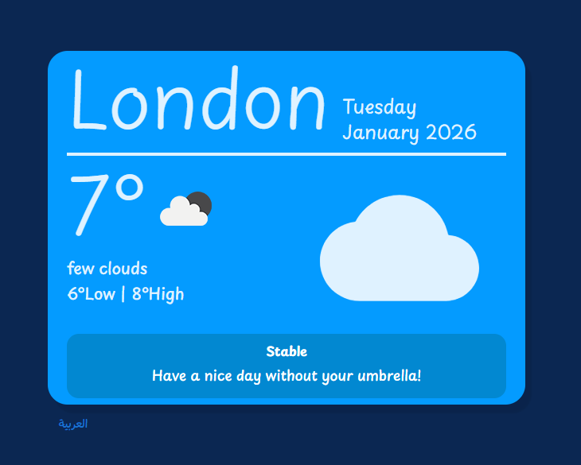
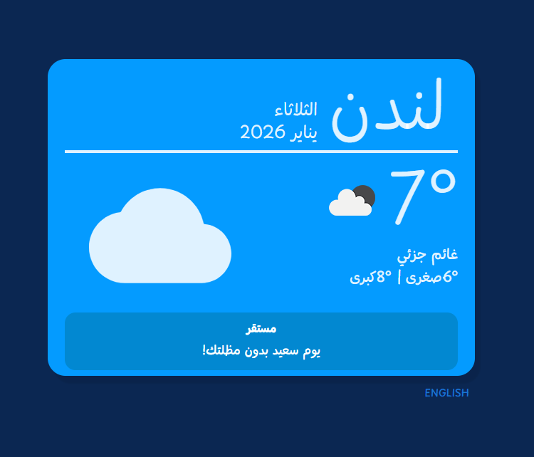

# Should I Get an Umbrella?

A bilingual weather application that helps users decide whether an umbrella is actually useful, based on real-time weather conditions and smart alerts.

---

## Overview

This project fetches live weather data from the OpenWeather API and displays contextual alerts depending on the weather condition (such as storms, rain, or clear skies).  
The application supports both Arabic and English with dynamic UI direction switching.

---

## Features

- Real-time weather data using OpenWeather API
- Arabic and English language support (i18n)
- Automatic RTL / LTR layout switching
- Smart weather alerts based on weather condition IDs
- Context-aware messages (e.g. storms, rain, clear weather)
- Weather icons loaded dynamically from the API
- Date formatting using Day.js
- UI components and alerts built with Material UI

---

## Alert Logic

The alert content changes dynamically depending on the weather condition:

- Storm: alerts the user that an umbrella is not sufficient
- Rain: suggests taking an umbrella
- Snow: remind to take the polar coat
- Clear weather: indicates that no umbrella is needed

All alerts are localized in both Arabic and English and in a funny language to improve the UX.

---

## Tech Stack

- React
- TypeScript
- OpenWeather API
- Material UI (MUI)
- Day.js
- i18next

---

## Code Structure

- Custom React Hooks for reusable logic
  - Data fetching
  - Language and direction handling
- State and performance management using:
  - useState
  - useEffect
  - useMemo
  - AbortController for cancelling in-flight API requests
- Clean separation between UI and logic
- Prevents unnecessary API calls when the component unmounts or dependencies change
- Shared types and interfaces in `src/types/weather.ts`

---

## TypeScript

This project was migrated from JavaScript to TypeScript. Key decisions:

- Shared interfaces (`WeatherState`, `WeatherMessage`) extracted to `src/types/weather.ts`
- All components and hooks typed with explicit interfaces
- MUI `severity` prop typed as a union type instead of `string`
- `ReactNode` used for component `children` props

---

## Live Demo

Live version:  
https://shouldigetanumbrella.netlify.app

---

## Screenshots

### English Version

### Arabic Version

---

## Notes

This project focuses on logic-driven UI, localization, and real-world API integration.  
It demonstrates how to approach real product requirements using React and modern frontend tools.
